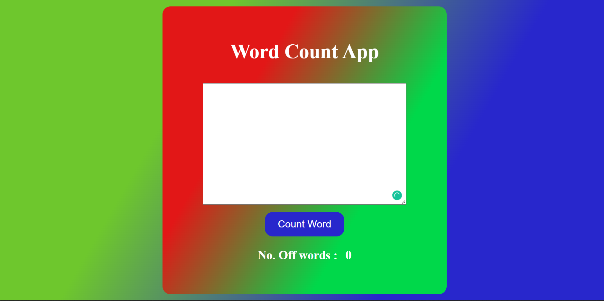
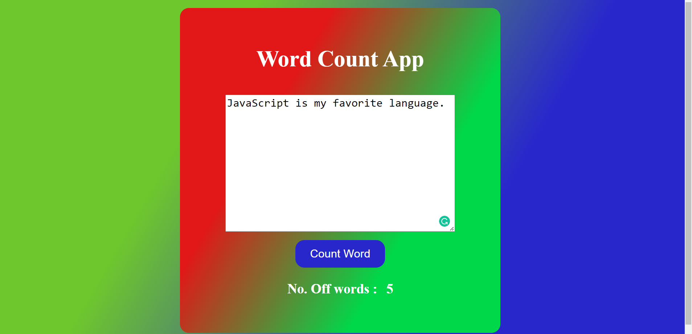

## What to build

we have to Word Count App.

## Input

## Techanology used

we have used HTML, CSS and JavaScript DOM

## What I have learned from this project

I have learned how to read textArea value, and how to use reguler expression to replace one or more than one space with one space to textArea value. And how to Find number of words in that sentance which entered In textArea and display that value on page.

## Output

### Instructor

**Hitesh choudhary**
